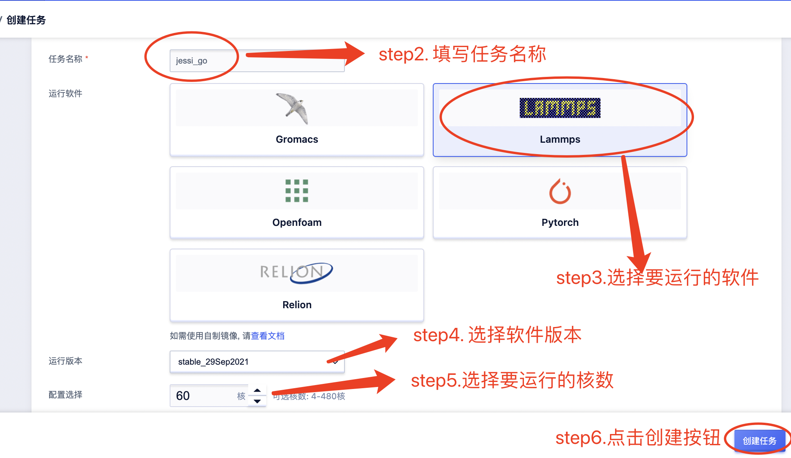
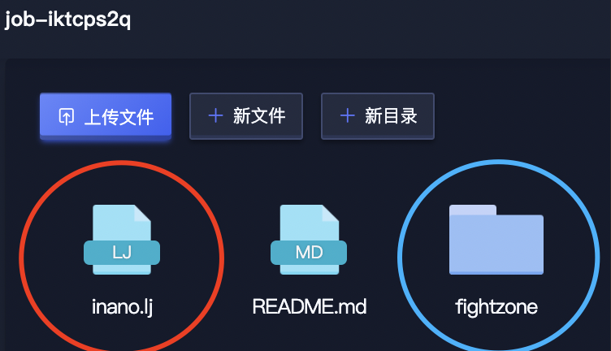
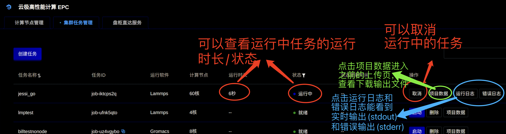
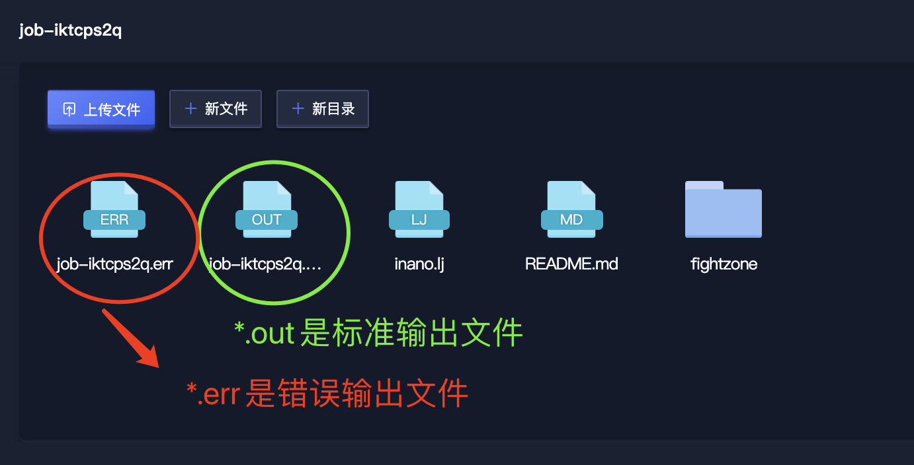

# EPC-Cluster产品文档
## 瞄点
[overall](#overall)

[filestash](#filestash)

[diyimage](#diyimage)

[howtorun](#howtorun)

[howtorun_detail](#howtorun_detail)

<span id="overall"></span>

## 一次任务的完整流程
### 算例数据
lammps: [输入数据](./files/fastone_lammps_case.tgz)

### 创建任务


<span id="diyimage"></span>



#### 软件列表没有我想要的软件或软件版本？

epc cluster提供自制镜像(singularity)能力，如需自制镜像：联系我们上传您的singularity文件，并指定此文件(xx.sif)想要显示的软件和版本，然后此文件表示的镜像将新增在上方软件和版本选择中

<span id="filestash"></span>

### 上传项目数据(filestash)


### 启动任务


<span id="howtorun"></span>

#### 在epc cluster上拼写自己的第一个命令
点击启动按钮后，出现命令输入框，输入框里有给出命令的模板，根据模板补全其中的问号（？？）部分，即可拼写出该软件的典型命令。


例如:

```shell
#软件给出
lmp_mpi < ./??
#用户补全为
lmp_mpi < ./inano.lj
```
在用户正确上传inano.lj(如图)的前提下，任务运行成功



成功的任务（可从"项目数据"下载输出文件）：


#### 还是有疑问？
[完整的指令拼写](#howtorun_detail)

### 查看任务/下载输出文件





<span id="howtorun_detail"></span>

### 如何正确拼写您的命令?
无需关注与命令无关的openmpi/slurm/singularity指令，仅填写运行任务本身的指令即可。例如：


#### 在裸机上运行的命令输入

```shell
#!/bin/bash
#SBATCH --partition=compute
#SBATCH -N 2
#SBATCH --job-name=gromacs_demo
#SBATCH --output=jobs/gmx-%j.out
#SBATCH --error=jobs/gmx-%j.err
#SBATCH --ntasks-per-node=32

export OMPI_ALLOW_RUN_AS_ROOT=1
export OMPI_ALLOW_RUN_AS_ROOT_CONFIRM=1

cd gromacs_water/1536
#预处理
singularity exec -H `pwd` /gv_images_production/public/gromacs/2021.4/gromacs.sif gmx_mpi grompp -f pme.mdp -c conf.gro -p topol.top -o water_pme.tpr
#正式模拟
srun mpirun -np 64 singularity exec -H `pwd` /gv_images_production/public/gromacs/2021.4/gromacs.sif gmx_mpi mdrun -v -ntomp 1 -nsteps 5000 -pin on -s water_pme.tpr
```

#### 对应在epc cluster平台输入命令

```shell
cd gromacs_water/1536
gmx_mpi grompp -f pme.mdp -c conf.gro -p topol.top -o water_pme.tpr
gmx_mpi mdrun -v -ntomp 1 -nsteps 5000 -pin on -s water_pme.tpr
```

#### 总结
在epc cluster平台上输入命令和裸机命令的对比
```shell
#在裸机上运行的命令输入由5部分组成
part1: sbatch脚本 {

指令1：srun mpirun -np 64 singularity exec -H `pwd` /xx.sif gmx_mpi grompp..

指令2(抽象表示)：{srun} {mpirun -np 64} {sigularity exec -H `pwd` /xx.sif } {gmx_mpi mdrun..}  

指令3(抽象表示,如后处理等..)：{part2: srun} {part3: mpi} {part4: sig} {part5: cmd}

}
# 在epc cluster平台上输入的命令只有第5部分
运行命令输入框：
-------------------
| gmx_mpi grompp..
| gmx_mpi mdrun..
| cmd
--------------------
```
