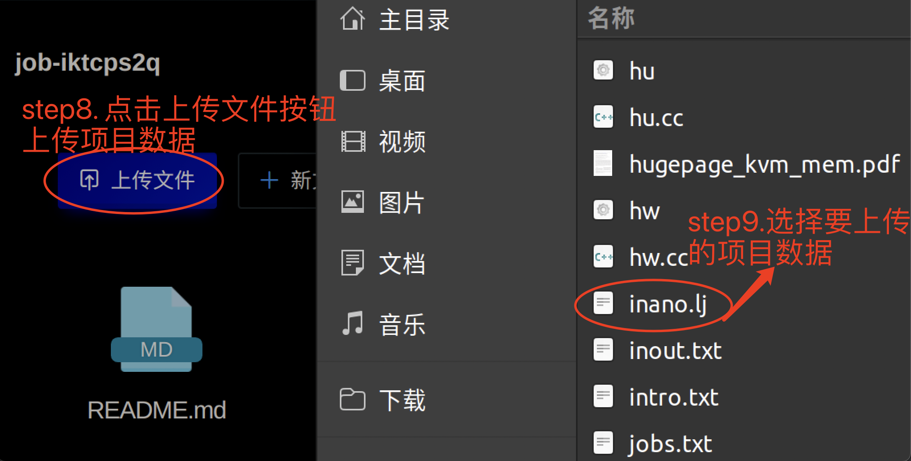
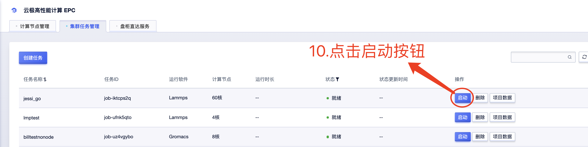
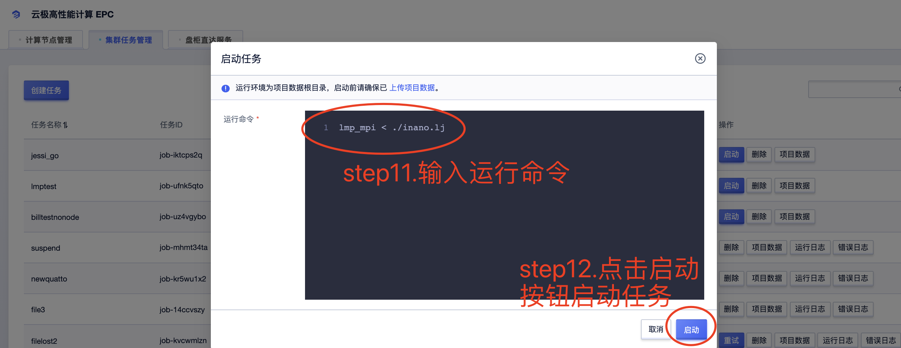
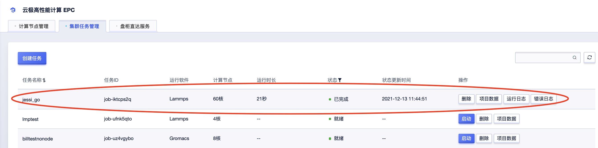
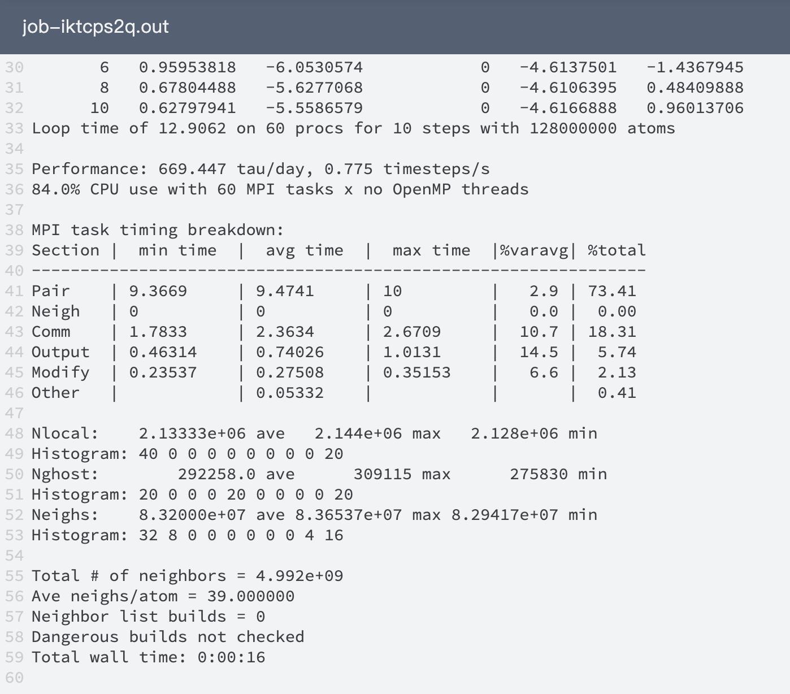

# EPC-Cluster产品文档
## 核心问题
[完整流程](#overall)

[文件管理-上传](#filestash)

[文件管理-下载](#filestash2)

[自制镜像](#diyimage)

[拼写命令-简易](#howtorun)

[拼写命令-详细](#howtorun_detail)

<span id="overall"></span>

## 一次任务的完整流程
### 算例数据
以Lammps软件为例: [输入数据](http://117.50.22.60/inano.lj)

### 创建任务


<span id="diyimage"></span>


#### 软件列表没有我想要的软件或软件版本？

epc cluster提供自制镜像(singularity)能力，如需自制镜像：联系我们上传您的singularity文件，并指定此文件(xx.sif)想要显示的软件和版本，然后此文件表示的镜像将新增在上方软件和版本选择中

<span id="filestash"></span>

### 上传项目数据




### 启动任务




<span id="howtorun"></span>

#### 在epc cluster上拼写自己的第一个命令
点击启动按钮后，出现命令输入框，输入框里有给出命令的模板，根据模板补全其中的问号（？？）部分，即可拼写出该软件的典型命令。


例如:

```shell
#软件给出
lmp_mpi < ./??
#用户补全为
lmp_mpi < ./inano.lj
```
在用户正确上传inano.lj(如图)的前提下，任务运行成功


注：命令模板只是对初次上手的提示，不是所有命令都能通过填充问号部分(？？)就能得到，熟悉的用户可以删掉提示并完全填写自己的指令，例如：如果上图中文件inano.lj位于目录fightzone内，则命令行可以是：

```shell
## 进入输入文件所在目录
cd fightzone
## 对应lammps软件，指定输入文件可以用<<，也可以用-i
lmp_mpi -i ./inano.lj
```

#### 还是有疑问？
[完整的指令拼写](#howtorun_detail)

成功的任务（可从"项目数据"下载输出文件）：


### 查看任务/下载输出文件


<span id="filestash2"></span>




<span id="howtorun_detail"></span>

### 如何正确拼写您的命令?
无需关注与命令无关的openmpi/slurm/singularity指令，仅填写运行任务本身的指令即可。以Gromacs软件为例：


#### 在裸机上运行的命令输入

```shell
#!/bin/bash
#SBATCH --partition=compute
#SBATCH -N 2
#SBATCH --job-name=gromacs_demo
#SBATCH --output=jobs/gmx-%j.out
#SBATCH --error=jobs/gmx-%j.err
#SBATCH --ntasks-per-node=32

export OMPI_ALLOW_RUN_AS_ROOT=1
export OMPI_ALLOW_RUN_AS_ROOT_CONFIRM=1

cd gromacs_water/1536
#预处理
singularity exec -H `pwd` /gv_images_production/public/gromacs/2021.4/gromacs.sif gmx_mpi grompp -f pme.mdp -c conf.gro -p topol.top -o water_pme.tpr
#正式模拟
srun mpirun -np 64 singularity exec -H `pwd` /gv_images_production/public/gromacs/2021.4/gromacs.sif gmx_mpi mdrun -v -ntomp 1 -nsteps 5000 -pin on -s water_pme.tpr
```

#### 对应在epc cluster平台输入命令

```shell
cd gromacs_water/1536
gmx_mpi grompp -f pme.mdp -c conf.gro -p topol.top -o water_pme.tpr
gmx_mpi mdrun -v -ntomp 1 -nsteps 5000 -pin on -s water_pme.tpr
```

#### 总结

| 指令序号| srun | openmpi | singularity | 用户指令(唯一需要用户在命令行输入框填入的指令) |
|---|  ---  | ----  | --- | --- |
|指令1| \ | \ |singularity exec -H `pwd` {镜像目录}/gromacs.sif | gmx_mpi grompp -f pme.mdp -c conf.gro -p topol.top -o water_pme.tpr|
|指令2| srun |mpirun -np 64 |singularity exec -H `pwd` {镜像目录}/gromacs.sif| gmx_mpi mdrun -v -ntomp 1 -nsteps 5000 -pin on -s water_pme.tpr |
